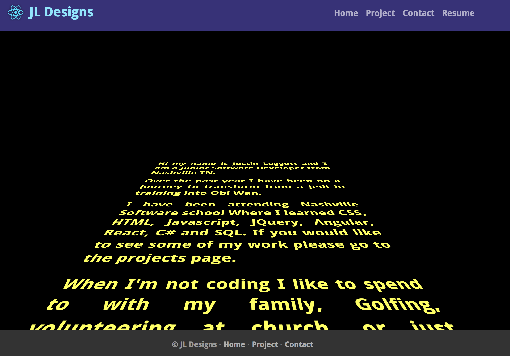

#Portfolio Website


## Description
In this project I created a website using react. 


## How to run
In your terminal run the following commands:
<br />
```
npm install
```
This will install all of the dependencies for the project.
<br />
Next type the following:
```
yarn start
```
Then navigate to [http://localhost:3001](http://localhost:3001) in your browser to view the output.

<!--## Screenshot
This is what the website looks like when it is loaded.
<br/>

<br/>-->

## Contributors
- [Justin Leggett](https://github.com/justinal64)
